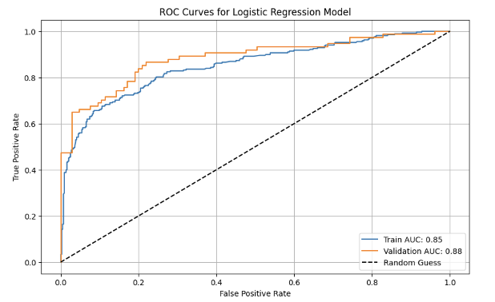
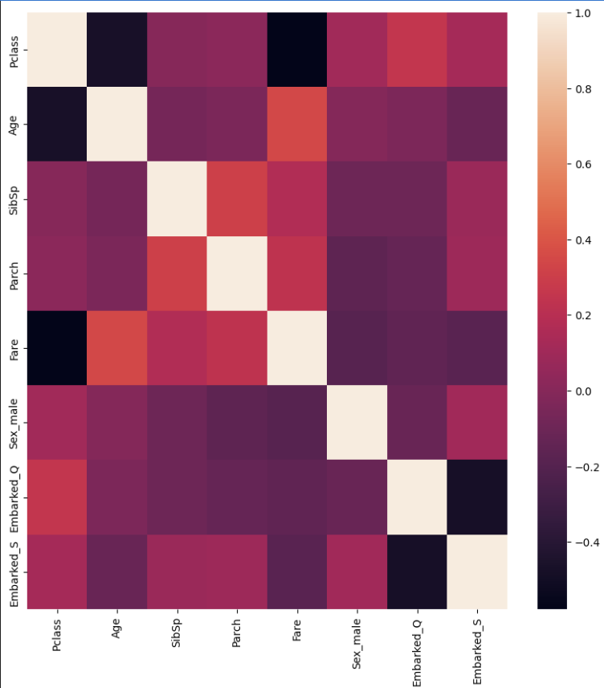

# Titanic Survival Prediction Model

## Basic Information
- **Group Members**: 
  - Jiwon (jiwon78@gwmail.gwu.edu)
  - Mehak (mehakpreet.kaur@gwmail.gwu.edu)
  - Owen (owandalowski@gwmail.gwu.edu)
  - Julia (jmillietsciorra@gwmail.gwu.edu)
- **Date**: 2024-12-02
- **Model Version**: 0.1
- **License**: MIT License
- **Model Implementation Code**: [Titanic_LogisticRegression](https://github.com/jiwonyun780/titanic-machine-learning-disaster/blob/main/Titanic_Project.ipynb)

### Intended Use
- **Primary Intended Uses**: The model is an example of a classifier used for machine learning educational purposes only.
- **Primary Intended Users**: Students and anyone interested in machine learning education. 
- **Out-of-Scope Use Cases**: Anything that is not for machine learning educational purposes.

## Training Data
- **Source**: [Kaggle Titanic - Machine Learning from Disaster](https://www.kaggle.com/c/titanic/data)
- **Split Method**:
  - 80% for training
  - 20% for validation
- **Number of Rows**:
  - Training: 713 rows
  - Validation: 178 rows

- **Data dictionary**:
# Titanic Survival Prediction Model

## Data Dictionary

| **Name**         | **Modeling Role** | **Measurement Level** | **Description**                                                             |
|-------------------|-------------------|-----------------------|-----------------------------------------------------------------------------|
| **PassengerID**   | ID                | int                   | Unique row identifier                                                      |
| **Survived**      | Target            | int                   | Survival status: 0 = no, 1 = yes                                           |
| **Pclass**        | Input             | int                   | Ticket class: 1 = 1st, 2 = 2nd, 3 = 3rd                                    |
| **Sex_male**      | Input             | boolean               | True = Male, False = Female                                                |
| **Age**           | Input             | float                 | Age in years                                                               |
| **SibSp**         | Input             | int                   | Number of siblings and spouses aboard the Titanic                          |
| **Parch**         | Input             | int                   | Number of parents and children aboard the Titanic                          |
| **Fare**          | Input             | float                 | Passenger fare                                                             |
| **Embarked_Q**    | Input             | boolean               | Port of embarkation: True = Queenstown, False = Cherbourg or Southampton   |
| **Embarked_S**    | Input             | boolean               | Port of embarkation: True = Southampton, False = Cherbourg or Queenstown   |

---

## Test Data
- **Source**: [Kaggle Titanic - Machine Learning from Disaster](https://www.kaggle.com/c/titanic/data)
- **Number of Rows**: 
  - Test data: 418 rows
- **Differences from Training Data**:
  - The test data does not include the `Survived` column, which is the target variable in the training data.

## Model Details
- **Input Columns**: 
  - Pclass
  - Age
  - SibSp
  - Parch
  - Fare
  - Sex_male
  - Embarked_Q
  - Embarked_S
- **Target Column**: 
  - Survived
- **Model Type**: 
  - Logistic Regression
- **Software Used**: 
  - Google Colab / Python
- **Version**: 
  - Python version: 3.10.12
  - sklearn version: 1.5.2
- **Hyperparameters**: 
  - **Max_iter**: 1000  
    Ensures sufficient iterations for convergence of the optimization algorithm.
  - **Random_state**: 42  
    Ensures reproducibility by fixing the randomness in processes.

## Quantitative Analysis

### **Performance Metrics Table**

| Train Accuary  | Validation Accuracy | Test Accuracy  |
|--------------|--------------|----------|
|    0.80056 | 0.81006      | 0.76315     |

- **ROC AUC**: The Area Under the Receiver Operating Characteristic Curve measures the model's ability to distinguish between classes.
  
| Data Split   | ROC AUC  | 
|--------------|----------|
| Training     | 85.0     |
| Validation   | 88.0     |

### **Visualization**
Below is the ROC Curve for the Logistic Regression Model:

### **Correlation Heatmap**

---

## Ethical Considerations

### Potential Negative Impacts
- **Math or Software Problems**:
  - Bias in training data (e.g., imbalanced classes) can lead to poor generalization.
  - Missing or imputed values might introduce inaccuracies in predictions.
- **Real-World Risks**:
  - Misclassification could lead to incorrect decisions in critical scenarios.
  - Discrimination against underrepresented groups in the dataset.

### Potential Uncertainties
- **Math or Software Problems**:
  - Uncertainty in the model’s performance on unseen data, especially given class imbalance.
  - Overfitting to training data due to dataset-specific patterns.
- **Real-World Risks**:
  - The model might not generalize well across different populations or settings.
  - Ethical implications may arise when predictions affect human lives or rights.

### Unexpected Results
- The test set containing only one class highlighted the need for balanced datasets.
- This unexpected outcome underscores the importance of careful dataset preparation before training and evaluation.

